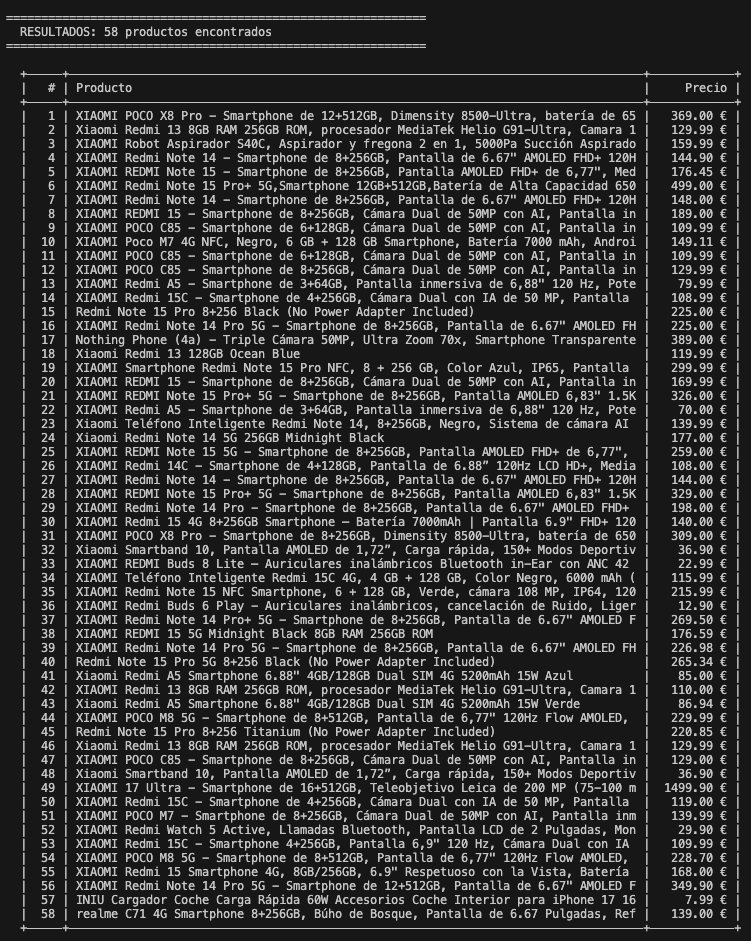
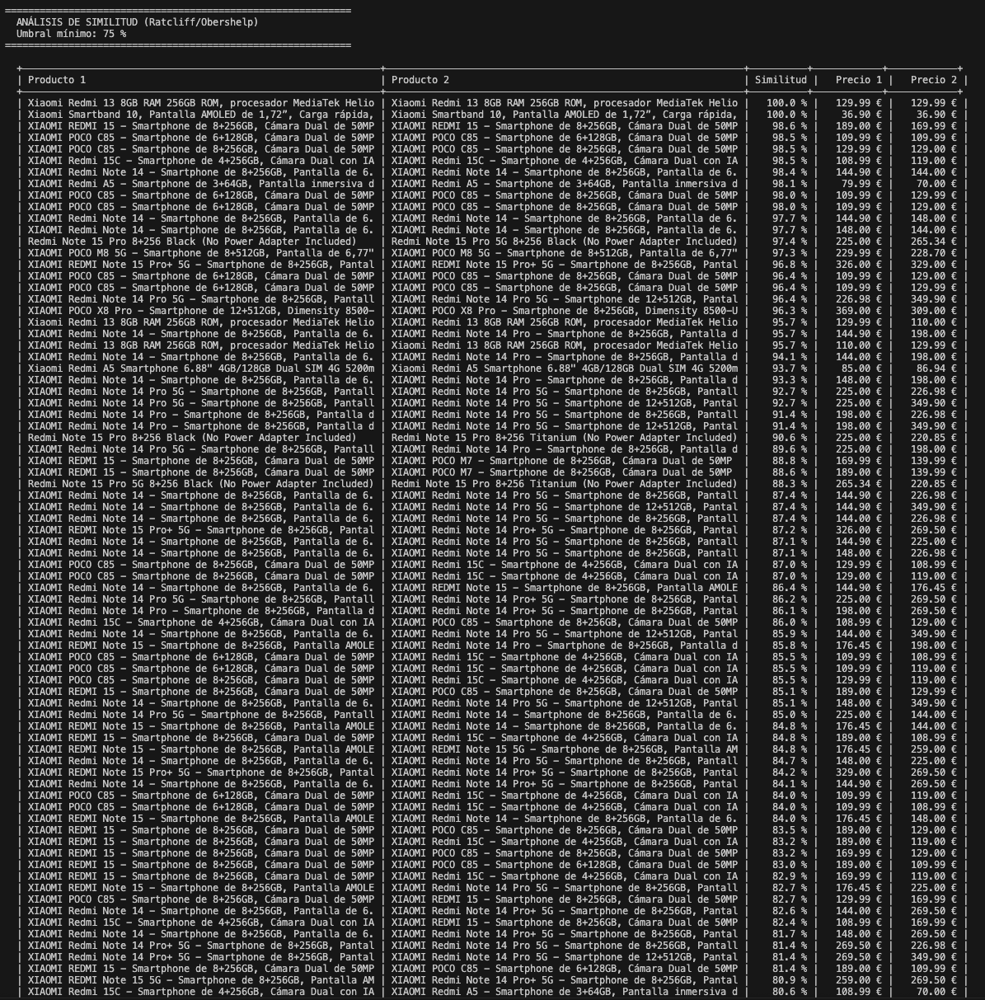
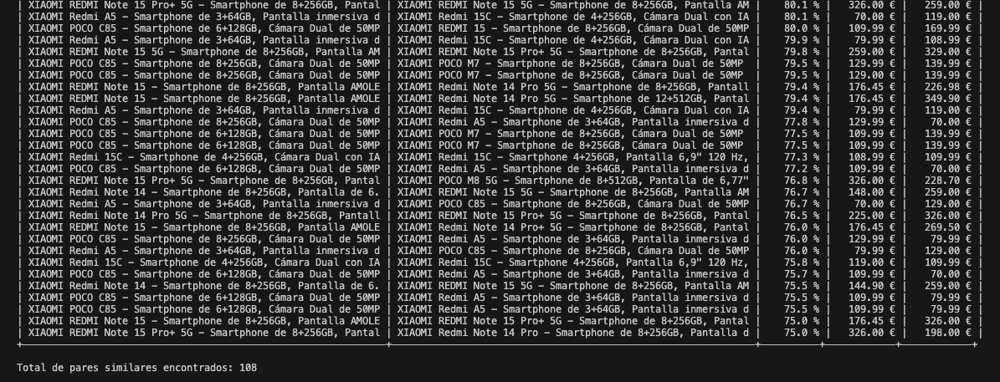
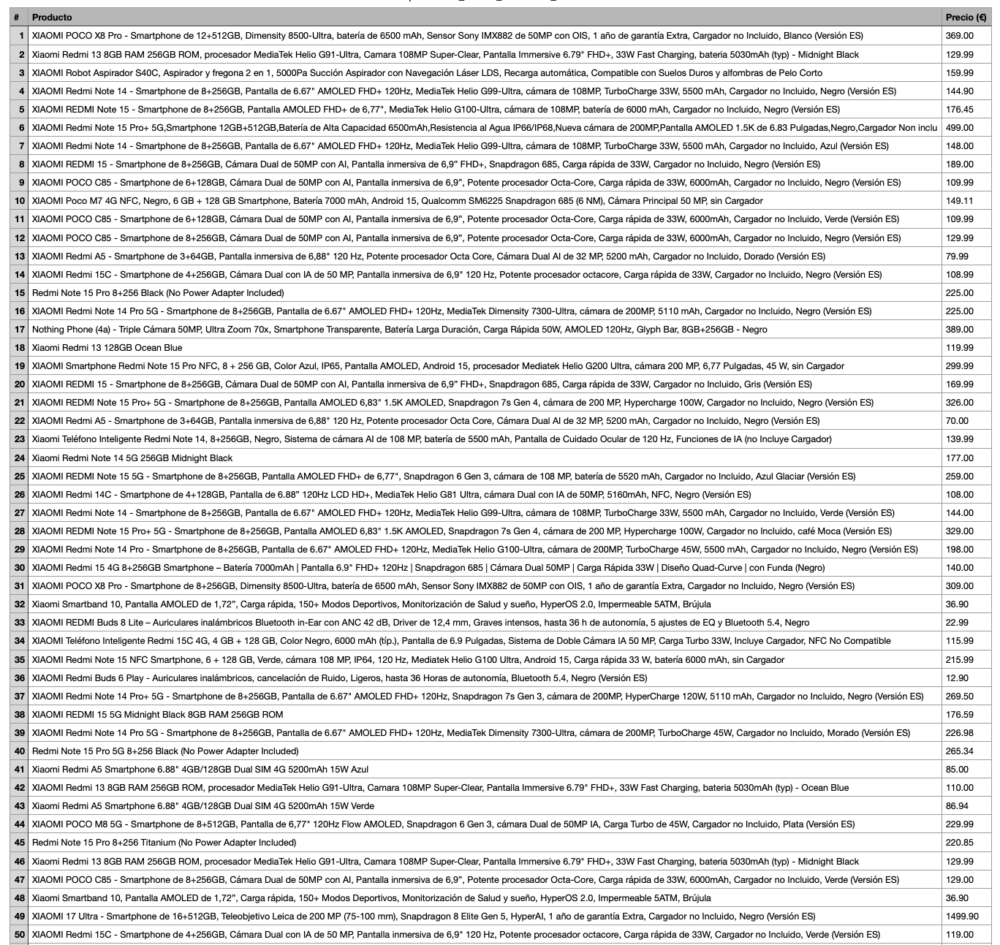
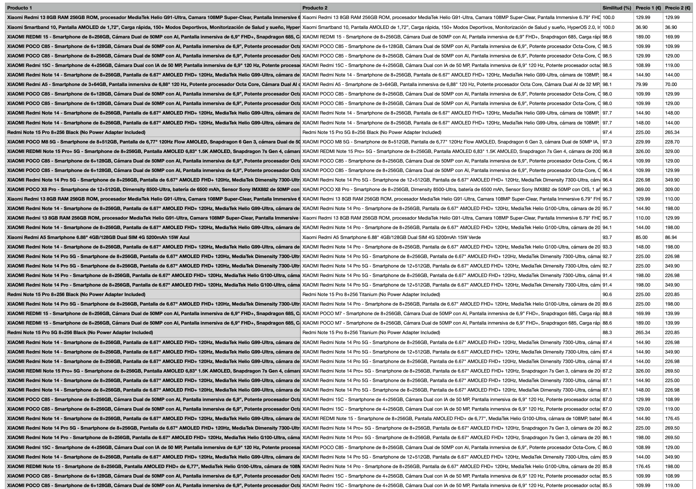

# 🔍 Análisis de Similitud de Productos Xiaomi en Amazon

Script en Python que hace **web scraping** de productos Xiaomi en Amazon España y luego analiza qué tan parecidos son entre sí usando un algoritmo de similitud de texto.

---

##  ¿Qué hace este proyecto?

1. **Scraping de Amazon** — Abre Safari, busca "xiaomi" en Amazon.es y extrae el nombre y precio de cada producto.
2. **Análisis de similitud** — Compara todos los títulos entre sí para encontrar productos que podrían ser el mismo (o muy parecidos) publicados por distintos vendedores.
3. **Resultados en tabla** — Muestra los productos en una tabla formateada, y los pares similares con su porcentaje de similitud.
4. **Exportar a CSV** — Al finalizar, te pregunta si quieres guardar las tablas como archivos `.csv` que se abren directamente en **Excel** o **Numbers**.

---

##  Algoritmo de similitud utilizado

Este proyecto usa el algoritmo **Ratcliff/Obershelp**, implementado en Python a través de [`difflib.SequenceMatcher`](https://docs.python.org/3/library/difflib.html#difflib.SequenceMatcher).

### ¿Cómo funciona?

El algoritmo de Ratcliff/Obershelp calcula la similitud entre dos cadenas de texto siguiendo estos pasos:

1. **Encuentra la subcadena común más larga** entre los dos textos.
2. **Aplica el mismo proceso recursivamente** a las partes que quedan a la izquierda y a la derecha de esa subcadena.
3. **Calcula el ratio de similitud** con la fórmula:

$$
\text{Similitud} = \frac{2 \times M}{T}
$$

Donde:
- $M$ = número total de caracteres coincidentes encontrados
- $T$ = número total de caracteres en ambas cadenas

### Ejemplo práctico

| Texto 1 | Texto 2 | Similitud |
|---------|---------|-----------|
| `"Xiaomi Redmi Note 12"` | `"Xiaomi Redmi Note 12 Pro"` | **91.7 %** |
| `"Xiaomi Band 8"` | `"Samsung Galaxy Watch"` | **11.4 %** |

El umbral por defecto es **75 %**: solo se muestran los pares que superen ese porcentaje.

### ¿Por qué este algoritmo?

- Viene incluido en la **biblioteca estándar** de Python (no requiere dependencias extra).
- Es **intuitivo**: devuelve un valor entre 0 % (nada en común) y 100 % (idénticos).
- Funciona bien para **comparar títulos de productos** donde el orden de las palabras suele ser similar.

---

##  Instalación y uso

### Requisitos previos

- **Python 3.8+**
- **macOS con Safari** (el script usa SafariDriver)
- Tener habilitado el *Develop menu* en Safari:
  - Safari → Preferencias → Avanzado → ✅ "Mostrar menú de desarrollo"
  - Luego ejecutar en terminal: `safaridriver --enable`

### Instalar dependencias

```bash
pip install -r requirements.txt
```

### Ejecutar el script

```bash
python analisis_similitud_xiaomi.py
```

---

##  Ejemplo de salida

### Tabla de productos encontrados



### Tabla de similitud entre productos





### Tablas abiertas en Excel / Numbers

| Productos | Similitud |
|:---------:|:---------:|
|  |  |

Los archivos CSV se guardan en el **Escritorio** y se pueden abrir directamente con doble clic en Excel o Numbers.

---

##  Estructura del proyecto

```
proyecto_analisis_similitud/
├── analisis_similitud_xiaomi.py   # Script principal
├── requirements.txt               # Dependencias de Python
├── .gitignore                     # Archivos ignorados por Git
├── README.md                      # Este archivo
└── images/                        # Capturas de pantalla del proyecto
```

---

##  Configuración

Puedes ajustar estas constantes al inicio del script:

| Variable | Valor por defecto | Descripción |
|----------|-------------------|-------------|
| `BUSQUEDA` | `"xiaomi"` | Término de búsqueda en Amazon |
| `UMBRAL_SIMILITUD` | `0.75` | Similitud mínima (75 %) para mostrar un par |

---

##  Licencia

Proyecto con fines educativos. No afiliado a Amazon. Los datos pueden variar.
